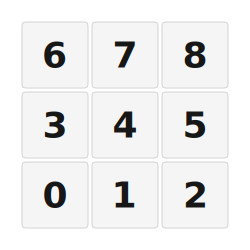

# ZMK Configuration for SpaceNumpad

*Generated by Shield Wizard for ZMK*



Download compiled firmware from the Actions tab. <https://zmk.dev/docs/user-setup#installing-the-firmware>

Edit your keymap <https://zmk.dev/docs/keymaps>.
User keymap is located at [`config/spacenumpad.keymap`](config/spacenumpad.keymap).

-----

<details>
<summary>
Shield Wizard Debug Information
</summary>

In case of broken configuration, here is the Shield Wizard internal data used to generate this configuration:

Commit: 8a52249f61161469b6d90ed8c80c4aa52b9f3858

```json
{"name":"SpaceNumpad","shield":"spacenumpad","dongle":false,"modules":[],"layout":[{"id":"01KJVA6783MZ2RTV1AS5DCYJMT","part":0,"row":0,"col":0,"w":1,"h":1,"x":0,"y":2,"r":0,"rx":0,"ry":0},{"id":"01KJVA67ZQKYWART750VZ0Z6CM","part":0,"row":0,"col":1,"w":1,"h":1,"x":1,"y":2,"r":0,"rx":0,"ry":0},{"id":"01KJVA68K0X8C8QKGY5TYMJ30B","part":0,"row":0,"col":2,"w":1,"h":1,"x":2,"y":2,"r":0,"rx":0,"ry":0},{"id":"01KJVA6K0HM6C9F2BWWSK901E5","part":0,"row":0,"col":3,"w":1,"h":1,"x":0,"y":1,"r":0,"rx":0,"ry":0},{"id":"01KJVA6KSBNKN6XBBJ7AA02CQA","part":0,"row":0,"col":4,"w":1,"h":1,"x":1,"y":1,"r":0,"rx":0,"ry":0},{"id":"01KJVA6MGEVNYNGMQJ991BVW4Y","part":0,"row":0,"col":5,"w":1,"h":1,"x":2,"y":1,"r":0,"rx":0,"ry":0},{"id":"01KJVA6P9K6TM89EM7474JFKRN","part":0,"row":0,"col":6,"w":1,"h":1,"x":0,"y":0,"r":0,"rx":0,"ry":0},{"id":"01KJVA6PYH9PZW86Y20ACVCRGE","part":0,"row":0,"col":7,"w":1,"h":1,"x":1,"y":0,"r":0,"rx":0,"ry":0},{"id":"01KJVA6QE8B651F51PSH6VHS64","part":0,"row":0,"col":8,"w":1,"h":1,"x":2,"y":0,"r":0,"rx":0,"ry":0}],"parts":[{"name":"numpad","controller":"nice_nano_v2","wiring":"direct_gnd","keys":{"01KJVA6783MZ2RTV1AS5DCYJMT":{"input":"d9"},"01KJVA67ZQKYWART750VZ0Z6CM":{"input":"d8"},"01KJVA68K0X8C8QKGY5TYMJ30B":{"input":"d7"},"01KJVA6K0HM6C9F2BWWSK901E5":{"input":"d6"},"01KJVA6KSBNKN6XBBJ7AA02CQA":{"input":"d5"},"01KJVA6MGEVNYNGMQJ991BVW4Y":{"input":"d4"},"01KJVA6P9K6TM89EM7474JFKRN":{"input":"d3"},"01KJVA6PYH9PZW86Y20ACVCRGE":{"input":"d2"},"01KJVA6QE8B651F51PSH6VHS64":{"input":"d10"}},"encoders":[],"pins":{"d9":"input","d8":"input","d7":"input","d6":"input","d5":"input","d4":"input","d3":"input","d2":"input","d10":"input"},"buses":[{"type":"spi","name":"spi0","devices":[]},{"type":"spi","name":"spi1","devices":[]},{"type":"spi","name":"spi2","devices":[]},{"type":"spi","name":"spi3","devices":[]},{"type":"i2c","name":"i2c0","devices":[]},{"type":"i2c","name":"i2c1","devices":[]}]}]}
```

</details>
# SpaceNumpad
